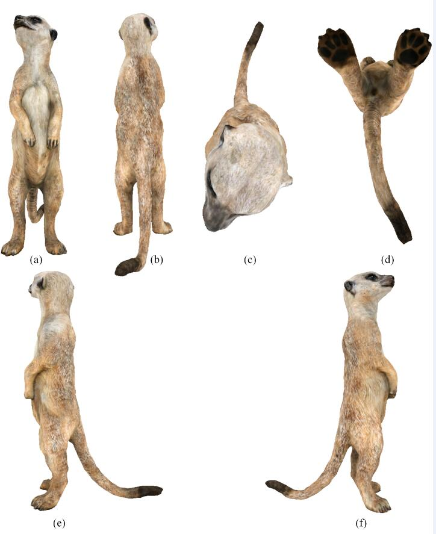
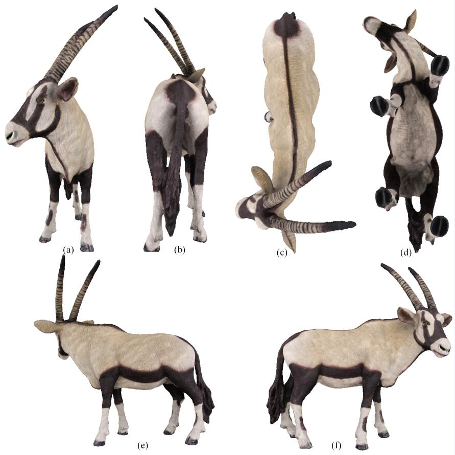
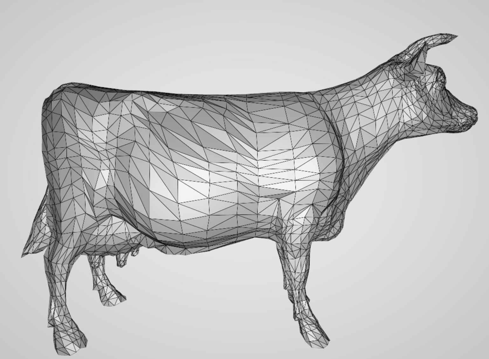

# D-QEM-Simplification
This repository contains the datasets, experimental results, and source code associated with our study:

-**Title:** Detail-Preserving Simplification of Textured Mesh Models for Natural Objects  
-**Authors:** Yuangang Liu et al.  
-**Status:** Manuscript under review

## Project structure:

### Data
*All raw data and experimental results, including the original 3D models and the test results of the simplification algorithm reported in this study.*  
-**Origin models:** The data files of the three test models—— Meerkat,Oryx, and Cow.  
A Meerkat 3D model viewing from 6 different dirctions (front, back, up, down, left,right).  

An Oryx 3D model viewing  from 6 different dirctions (front, back, up, down, left,right).  

A Cow 3D model without texture.  

-**Simplified models (results):** Resulting models at various levels of simplification generated using different simplification algorithms.  

### Source
| File                                      | Description                                                                                                                                                                          |
| ----------------------------------------- | ------------------------------------------------------------------------------------------------------------------------------------------------------------------------------------ |
| **Pair.cpp / Pair.h**                     | Defines the `Pair` class, representing an edge in the mesh for simplification, including attributes and operations related to the edge collapse cost calculation.               |
| **PairHeap.cpp / PairHeap.h**             | Implements a heap structure (`PairHeap`) to efficiently manage and retrieve edge pairs with the lowest collapse cost during mesh simplification.                                     |
| **Point.cpp / Point.h**                   | Defines the `Point` class representing a 3D vertex, including coordinates, normal vectors, and related operations.                                                                   |
| **PointSet.cpp / PointSet.h**             | Implements a `PointSet` class to manage a collection of points in the mesh, supporting operations such as adjacency queries and update of mesh connectivity.                         |
| **Simplification.cpp / Simplification.h** | Core implementation of the D-QEM mesh simplification algorithm, integrating point, pair, and pair heap structures to progressively simplify the 3D mesh while preserving geometric detail. |

 
 ### Error Metric
*Metrics evaluating the geometric and texture errors of the results.*
  
## Data structures
-**.obj file:** It is a geometric definition file format and belongs to 3D model files. It mainly stores the geometric information of 3D models, such as vertex coordinates, texture coordinates, normal vectors, and the connection relationship of polygonal faces.  
-**.mtl file:** It is a material library file matched with the .obj file. It stores the material information  of 3D models, such as the name, color, reflectivity, transparency, texture mapping and other parameters of the material.  
-**.jpg file (such as Meerkat_COLOR.jpg, Oryx_COLOR.jpg):** It is an image file format. In the scenario related to 3D models, this type of file is usually used as a texture map, mapping the image to the surface of the 3D model, adding details such as colors and patterns to the model, making the 3D model look more realistic and vivid.  
